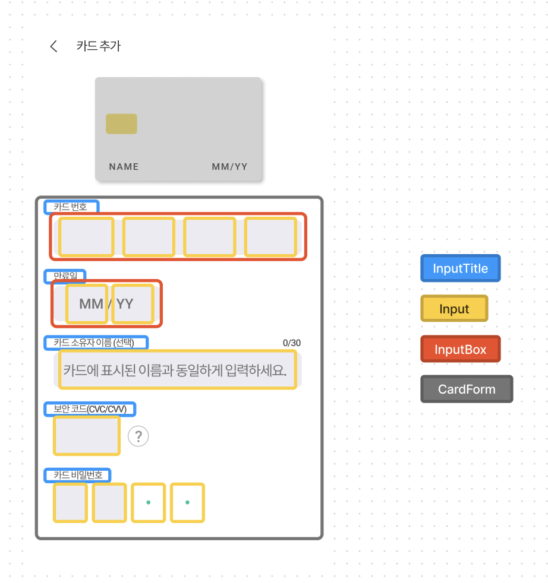

# payssion

NEXTSTEP 파이널 미션인 페이먼츠 앱 라이브러리, Payssion입니다.  
Payment💳 + Mission🎯 = Payssion🔥

# 사용법

1. 설치하기

   ```js
   // npm
   npm i payssion

   // yarn
   yarn add payssion
   ```

2. 준비하기 (PayssionProvider)

   ```js
   import { PayssionProvider } from 'payssion'

   function App() {
     return (
       <BrowserRouter>
         <PayssionProvider>
           <Routes>
             {routes.map((route) => (
               <Route key={route.path} path={route.path} element={route.element} />
             ))}
           </Routes>
         </PayssionProvider>
       </BrowserRouter>
     )
   }
   ```

3. 결제 시작하기 (initiatePayment)

- amount, onSuccessAction는 필수입니다.

- initiatePayment 타입

  ```ts
  type InitiatePaymentParams = {
    amount: number
    onSuccessAction: () => void
  }
  ```

- 예시 코드

  ```js
  import { usePayssion } from 'payssion'

  const PaymentComponent = () => {
    const [amount, setAmount] = useState(0)
    const onSuccessAction = () => {
      // 성공 시 동작할 코드
    }
    const { initiatePayment } = usePayssion()
    return (
      <>
        <SomeComponent />
        <PaymentButton onClick={() => initiatePayment({ amount, onSuccessAction })} />
      </>
    )
  }
  ```

4. 결제 모듈 열기

   ```tsx
   import { Payssion, isOpen } from 'payssion'

   const SomeComponent = () => {
     const { isOpen } = usePayssion()

     return (
       <>
         <Header />
         <Description />
         {isOpen && <Payssion />}
       </>
     )
   }
   ```
# 사용 예시


   https://user-images.githubusercontent.com/76519867/236610713-583ae107-90b6-4387-ba38-99ac2f8e9215.mov


# 프로젝트 요약

1. CDD에 따라 UI를 구성하고 재사용 가능한 컴포넌트를 작성하였습니다.
2. 스토리북을 통해 컴포넌트 별 상호작용 테스트를 했습니다.
3. Context API를 이용해 전역 상태 관리와 계층을 재구성했습니다.
4. 비제어 컴포넌트를 이용해 Form을 제어했습니다.
5. NPM 배포를 통해 타 앱에서 페이먼츠 라이브러리로 사용할 수 있습니다.

# 고민의 흔적들

## 1. 컴포넌트와 CDD

### 더 깊게 알아본 재사용 가능한 컴포넌트

- '재사용 가능한 컴포넌트' 라는 당연시해서 사용되는 문장을 키워드로 분리하고, 곱씹어보면서 함의를 고민했습니다. [문서 링크](https://alwayshere.vercel.app/blog/20230505)

### UI와 로직의 관심사 분리

- 거의 모든 컴포넌트에 대한 로직을 훅으로 분리해 Headless UI로 구성했습니다.

  ```tsx
  const CardAdd = () => {
    const {
      numbersRef,
      passwordRef,
      expiredDateRef,
      ownerRef,
      securityCodeRef,
      openValidToast,
      setOpenValidToast,
      onBeforeNavigate,
      isValidCardInfo,
    } = useCardAdd()

    return (
      //...
    )
  }
  ```

- 커스텀 훅은 재사용성을 고려해 가능한 가까운 곳에 위치시키고자 했습니다.  
  CardAdd  
  ┣ components  
  ┃ ┣ CardForm  
  ┃ ┃ ┣ components  
  ┃ ┃ ┣ hooks --> CardForm 내부 컴포넌트에 대한 커스텀 훅  
  ┃ ┃ ┣ CardForm.tsx  
  ┃ ┗ index.ts  
  ┣ hooks --> CardAdd 컴포넌트에 대한 커스텀 훅  
  ┣ CardAdd.tsx

### 꼭 필요한 상태인가?

- 상태가 많아진다는 것은 관리 포인트가 늘어나는 것이라는 생각을 바탕으로 기능이 동작하는 '최소한의 상태'로 만들고자 했습니다.

  - 예를들어 아래 가상 키보드의 경우 모달 종료를 위한 ref 상태를 제외하고, 어떤 상태도 가지고 있지 않습니다.
  - 대신 props로 전달받는 onKeyPress, 도메인 함수인 getRandomVirtualDigits 등의 값을 이용해 상태는 최소화하면서 기능이 동작하도록 작성했습니다.
  - 이를 통해 컴포넌트의 재사용성이 증가라는 추가 장점을 얻을 수 있었습니다.

  ```tsx
  const VirtualKeyboard = ({ onKeyPress }: VirtualKeyboardProps) => {
    const { modalRef } = useVirtualKeyboard()

    return (
      <div ref={modalRef}>
        <BottomSheetContainer>
          <DigitButtonContainer>
            {getRandomVirtualDigits().map((digit) => (
              <DigitButton key={digit} onClick={() => onKeyPress(String(digit))}>
                {digit}
              </DigitButton>
            ))}
          </DigitButtonContainer>
        </BottomSheetContainer>
      </div>
    )
  }
  ```

### CDD란 무엇일까?

- [React로 사고하기](https://ko.legacy.reactjs.org/docs/thinking-in-react.html)문서를 바탕으로 1단계: UI를 컴포넌트 계층으로 나누기, 2단계: React로 정적인 버전 만들기, 3단계: UI state에 대한 최소한의 (하지만 완전한) 표현 찾아내기, 4단계: State가 어디에 있어야 할 지 찾기 이렇게 4가지 단계로 컴포넌트를 설계하도록 했습니다.
- Form을 1단계 컴포넌트 계층으로 나눈다면?

  

- 이를 코드로 구현한다면?

  ```tsx
  // InputTitle
  const InputTitle = ({ children }: PropsWithChildren) => {
    return <StyledInputTitme>{children}</StyledInputTitme>
  }

  // Input.tsx
  const Input = forwardRef(({ type = 'text', css, ...props }: InputProps, ref: ForwardedRef<HTMLInputElement>) => {
    return <InputBasic ref={ref} type={type} css={{ ...css }} {...props} />
  })

  // InputBox.tsx
  const InputBox = ({ children, css }: PropsWithChildren<InputBoxProps>) => {
    return <StyledInputBox css={{ ...css }}>{children}</StyledInputBox>
  }

  // CardExpiredDate.tsx
  const CardExpiredDate = ({ expiredDateRef }: CardExpiredDateProps) => {
    const { handleInputChange } = useCardExpiredDate()

    return (
      <InputContainer>
        <InputTitle>만료일</InputTitle>
        <InputBox css={{ width: '50%' }}>
          <Input ref={expiredDateRef.first} placeholder="MM" data-name="MM" onInput={handleInputChange} maxLength={2} />
          <Input
            ref={expiredDateRef.second}
            placeholder="YY"
            data-name="YY"
            onInput={handleInputChange}
            maxLength={2}
          />
        </InputBox>
      </InputContainer>
    )
  }

  // CardAdd.tsx (CardForm 역할)
  const CardAdd = () => {
    const {
      //...
    } = useCardAdd()

    return (
      <PayssionApp>
        //...
        <CardForm>
          <CardForm.CardNumbers />
          <CardForm.CardExpiredDate />
          <CardForm.CardOwner />
          <CardForm.CardSecurityCode />
          <CardForm.CardPassword />
        </CardForm>
        //...
      </PayssionApp>
    )
  }
  ```

## 2. 스토리북 상호작용 테스트

### 스토리북에 넣을 컴포넌트 기준

나름의 기준을 정하고 아래와 같이 스토리북 계층을 구성하고 스토리북에 포함할 컴포넌트를 정리했습니다.

1. Props에 따라서 UI가 달라지는 컴포넌트
   1. Card
      - PreviewCard
      - BigCard
      - SmallCard
   2. Button
      - CardTypeButton
      - NavigationButton
   3. Modal
      - CardTypeSelectionModal
      - VitualKeyboard
   4. Toast
   5. Tooltip
2. 유저와의 상호작용을 통해 UI가 달라지는 컴포넌트
   1. Input
   2. CardForm
      - CardNumbers
      - CardExpiredDate
      - CardOwner
      - CardPassword
      - CardSecurityCode
3. 컴포넌트의 조합으로 생성된 페이지
   1. /cart-add
   2. /card-completed
   3. /card-list
   4. /card-update

### Context API를 테스트 하려면? (업데이트 예정)

### Router를 테스트 하려면? (업데이트 예정)

### 인터렉션을 테스트 하려면? (업데이트 예정)

### 스토리북 내에서 Jest, Cypress 등을 테스트 하려면? (업데이트 예정)

### 레퍼런스

- [레퍼런스1](https://ui.toast.com/posts/ko_20220111)

## 3. Context API를 활용한 전역 상태 관리와 계층 재구성

### Context API를 사용한 이유

- 현재 관리되어야 하는 전역 상태는 많지 않기 때문에 다른 도구를 사용하는 것은 불필요하게 복잡성을 증가시킨다고 판단했습니다.
- 무분별한 서드 파티 라이브러리 사용을 지양합니다. 유지보수성을 고려했을 때 유지보수성을 고려했을 때 순수 React로 관리하는 것이 낫다고 판단했습니다.

### Context API로 관리하는 상태들

- CardList
- Card
- Modal
- Payssion

### 불필요한 리렌더링 방지

- CardContext의 경우 State, Dispatch의 두 가지 컨텍스트로 분리할 수 있었습니다. 이 두 가지는 아래 이미지와 같이 다른 컴포넌트에서 사용되기 때문에 하나의 컨텍스트로 묶을 경우 불필요한 리렌더링이 발생했습니다.  
   

- 아래와 같이 각 컨텍스트를 분리해서 제공하는 방식으로 문제를 해결했습니다.

  ```tsx
  // CardContext
  const CardStateContext = createContext<CardInfomation>(INITIAL_CARD_STATE as CardInfomation)
  const CardDispatchContext = createContext<CardDispatchContext>(() => {
    throw new Error('Cannot find CardProvider')
  })

  // CardProvider
  const CardProvider = ({ children }: PropsWithChildren) => {
    const [state, dispatch] = useReducer(cardReducer, INITIAL_CARD_STATE as CardInfomation)
    return (
      <CardStateContext.Provider value={state}>
        <CardDispatchContext.Provider value={dispatch}>{children}</CardDispatchContext.Provider>
      </CardStateContext.Provider>
    )
  }
  ```

## 4. 제어 & 비제어 컴포넌트

[관련 블로그 링크](https://alwayshere.vercel.app/blog/20230326)

### All 제어 컴포넌트

- 폼 제어가 필요한 Input은 카드 번호, 만료일, 카드 소유자, 보안코드, 비밀번호 다섯가지입니다.
- 처음에는 익숙했던 제어 컴포넌트로 모든 폼 제어를 완료했습니다.

### 부분적 비제어 컴포넌트

- 리팩토링을 진행하며 보안 코드, 비밀번호 상태값은 다음 버튼을 누를 때에만 필요하다는 것을 인지했습니다.
- 보안 코드, 비밀번호에 대해서는 비제어 컴포넌트로 관리했습니다.

### All 제어 컴포넌트

- 카드 번호, 만료일, 카드 소유자 정보 또한 상태값이 폼 내부에서 필요한 것이 아니라 외부 컴포넌트(카드)에서 필요하나는 것을 인지했습니다.
- 모든 폼 제어를 비제어로 시도하기 위해 Context API와 결합해 구현했습니다.
- 아래 코드는 CardExpiredDate에서 Context API와 비제어를 사용한 예시입니다.

  - CardExpiredDate 컴포넌트에서 사용되는 handleInputChange는 결국 useCardInfo에서 제공하는 handleExpiredDate 함수이며, 이 함수는 cardDispatch를 수행합니다.
  - 이를 통해 전역 Context에 만료일 상태값을 저장하며, Dispatch 컨텍스트만 소비하기 때문에 리렌더링은 발생하지 않습니다.

  ```tsx
  // CardExpiredDate.tsx
  const CardExpiredDate = ({ expiredDateRef }: CardExpiredDateProps) => {
    const { handleInputChange } = useCardExpiredDate()

    return (
      <InputContainer>
        <InputTitle>만료일</InputTitle>
        <InputBox css={{ width: '50%' }}>
          <Input ref={expiredDateRef.first} placeholder="MM" data-name="MM" onInput={handleInputChange} maxLength={2} />
          <Input
            ref={expiredDateRef.second}
            placeholder="YY"
            data-name="YY"
            onInput={handleInputChange}
            maxLength={2}
          />
        </InputBox>
      </InputContainer>
    )
  }

  // useCardExpiredDate.ts
  const useCardExpiredDate = () => {
    const { handleExpiredDate } = useCardInfo()
    const handleInputChange = (event: ChangeEvent<HTMLInputElement>) => {
      const {
        dataset: { name },
        value,
      } = event.target

      switch (name) {
        case 'YY':
          if (value.length === 2 && !isYearValid(Number(value))) {
            alert('유효기간이 만료되었습니다.')
            event.target.value = ''
            return
          }
          handleExpiredDate({ value, yymm: name })
          break
        case 'MM':
          if (Number(value) > 12 || Number(value) < 0) {
            alert('월은 1이상 12이하여야 합니다.')
            event.target.value = ''
            return
          }
          handleExpiredDate({ value, yymm: name })
          break
      }
    }

    return { handleInputChange }
  }

  // useCardInfo.ts
  const useCardInfo = () => {
    const cardDispatch = useContext(CardDispatchContext)

    const handleExpiredDate = ({ value, yymm }: HandleExpiredDateProps) => {
      if (!isNumber(value)) return
      switch (yymm) {
        case 'YY':
          cardDispatch({
            type: 'SET_EXPIRED_YEAR',
            payload: value,
          })
          break
        case 'MM':
          cardDispatch({
            type: 'SET_EXPIRED_MONTH',
            payload: value,
          })
          break
      }
    }

    // ...

    return {
      handleExpiredDate,
      // ...
    }
  }
  ```

## 5. NPM에 라이브러리 배포

### 사용자에게 어떤 값을 제공할지에 대한 고민

[GitHub Issue1 링크](https://github.com/herekim/payssion/issues/1)

- PayssionProvider, Payssion, usePayssion 세 가지로 분리해서 각각을 유저에게 전달하도록 했습니다.
- PayssionProvider는 페이먼츠 앱을 사용할 컴포넌트를 감싸는 Provider 함수입니다.
- Payssion은 실제 사용 컴포넌트입니다.
- usePayssion은 PayssionProvider에서 제공하는 값 중에 유저가 실제 필요한 값만 제공하는 커스텀 훅입니다. initiatePayment, isOpen, closePayment 세 가지의 값을 제공합니다.

### ESM, CJS, TypeScript 배포 문제 해결

- CRA를 사용하면서 craco로 오버 라이드를 하고 있었기 때문에 라이브러리용 빌드 파일을 만드는 것에 어려움이 있었습니다. 특히 ESM, CJS, TS 관련 설정을 목적에 맞게 설정하는 것이 까다로웠습니다.
- 그래서 Rollup을 이용해 Config를 작성해서 CJS, ESM, TS를 목적에 맞게 빌드 결과물을 얻을 수 있었습니다.

### CSS 클래스 이름 중복 문제 해결

[GitHub Issue2 링크](https://github.com/herekim/payssion/issues/2)

- 배포를 하고 나서 해당 라이브러리 테스트를 진행하자 정상적으로 UI가 보이지 않는 문제점이 있었습니다.
- 디버깅을 통해 클래스 이름이 겹치는 것이 원인임을 파악했습니다.
- 처음에는 CSS 모듈을 사용해서 해결하고자 했으나 모듈 환경 설정, 각 컴포넌트 코드 수정을 해야하는 것을 파악해서 CSS-In-JS를 사용하는 것과 도입 비용이 크게 다르지 않다고 판단했습니다.
- 그래서 Near Zero Runtime 라이브러리인 Stitches를 이용해 해시된 클래스 이름을 사용함으로써 문제를 해결할 수 있었습니다.

### 라우팅 관련 문제

- react-router-dom을 사용하면 사용자의 라우터와 겹치는 문제가 있었기 때문에 Context API로 페이지를 관리 했습니다.
